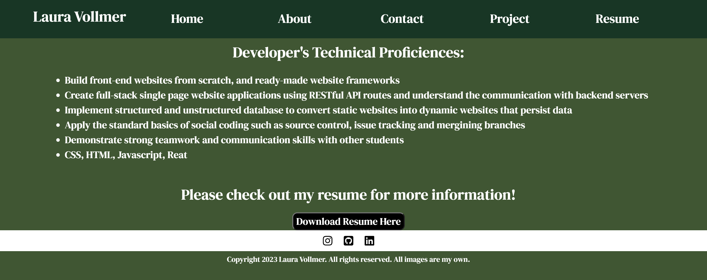

# react-personal-website

## Description

This project was to build a React single-application personal portfolio website to display work projects, a contact form, about me and a downloadable resume. When the portfolio page is visited, the end user will see a home page with a navigation bar with various options to visit different parts of the website. The navigation bar has a Home, Contact, About Me, Projects, Resume links that bring you to each section. The About Me section displays a photo and a short bio about myself. The contact area includes a form input where you can enter your name, email and question where you will be alerted to finish the contact information. The project section includes six projects, each with a picture and short project description. The resume section includes a technical proficiencies section and downloadable resume.

## Table of Contents

- [Website Pages](#websitepage)
- [Website Links](#websitelinks)
- [Technical Requirements](#technicalrequirements)
- [Credits](#credits)
- [License](#license)

  <a id="websitepage"></a>

## Website Pages

Home page:


Footer section of the page:


Resume page:


<a id="websitelinks"></a>

## Website Links

- Github Repo:https://github.com/lavollmer/react-personal-website

- Netifly:https://splendid-dolphin-6a0886.netlify.app/

  <a id="technicalrequirements"></a>

## Technical Requirements

Technical requirements for the application include:

- React
- Fontawesome
- CSS
- HTML
- React-router-dom
- Bootstrap
- Coolers
- Vite
- Google Fonts

<a id="credits"></a>

## Credits

This project was done in conjunction with the U of MN Bootcamp Fall 2023.

onBlur Inspiration:

- https://www.w3schools.com/jsref/event_onblur.asp
- https://www.reddit.com/r/reactjs/comments/pz1hvb/how_do_you_submit_react_hook_form_on_input_field/?rdt=49556

Download Resume inspiration:

- https://stackoverflow.com/questions/60922523/how-to-make-a-pdf-download-on-a-button-click-with-react

Xpert Learning Assistant provided this information (which I didn't use very much):

```
To create a navigation bar in React using React Router DOM and a Bootstrap template, you can follow these steps:

Install the required dependencies:

npm install react-router-dom bootstrap

Import the necessary components and styles:

import React from 'react';
import { BrowserRouter as Router, Route, Link } from 'react-router-dom';
import 'bootstrap/dist/css/bootstrap.min.css';

Create a functional component for the navigation bar:

const Navbar = () => {
return (

<nav className="navbar navbar-expand-lg navbar-light bg-light">
<Link className="navbar-brand" to="/">Home</Link>
<button
        className="navbar-toggler"
        type="button"
        data-toggle="collapse"
        data-target="#navbarNav"
        aria-controls="navbarNav"
        aria-expanded="false"
        aria-label="Toggle navigation"
      >
<span className="navbar-toggler-icon"></span>
</button>
<div className="collapse navbar-collapse" id="navbarNav">
<ul className="navbar-nav">
<li className="nav-item">
<Link className="nav-link" to="/about">About</Link>
</li>
<li className="nav-item">
<Link className="nav-link" to="/profile">Profile</Link>
</li>
</ul>
</div>
</nav>
);
};

Create the routes for your application:

const App = () => {
return (
<Router>
<Navbar />

<div className="container">
<Route path="/" exact component={Home} />
<Route path="/about" component={About} />
<Route path="/profile" component={Profile} />
</div>
</Router>
);
};

Implement the components for each route:

const Home = () => {
return <h1>Home Page</h1>;
};

const About = () => {
return <h1>About Page</h1>;
};

const Profile = () => {
return <h1>Profile Page</h1>;
};

Export the App component:

export default App;

Finally, render the App component in your index.js file:

import React from 'react';
import ReactDOM from 'react-dom';
import App from './App';

ReactDOM.render(<App />, document.getElementById('root'));

This setup will create a navigation bar using the Bootstrap template and handle the routing between different pages.
```

<a id="license"></a>

## License

No license
